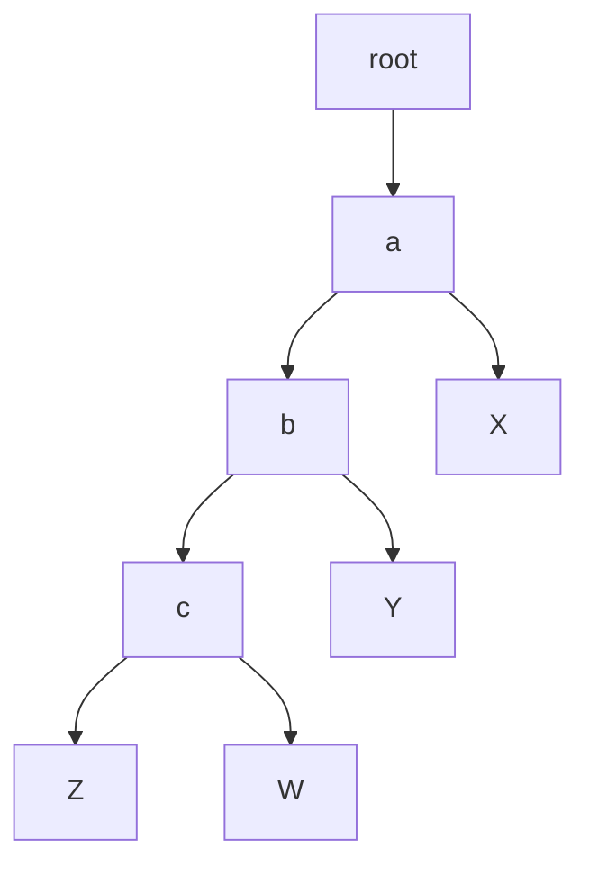
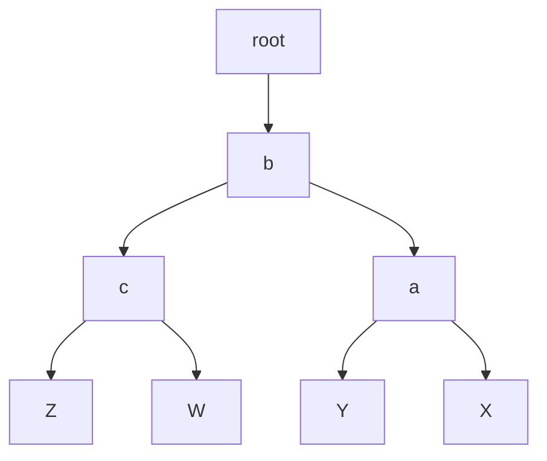
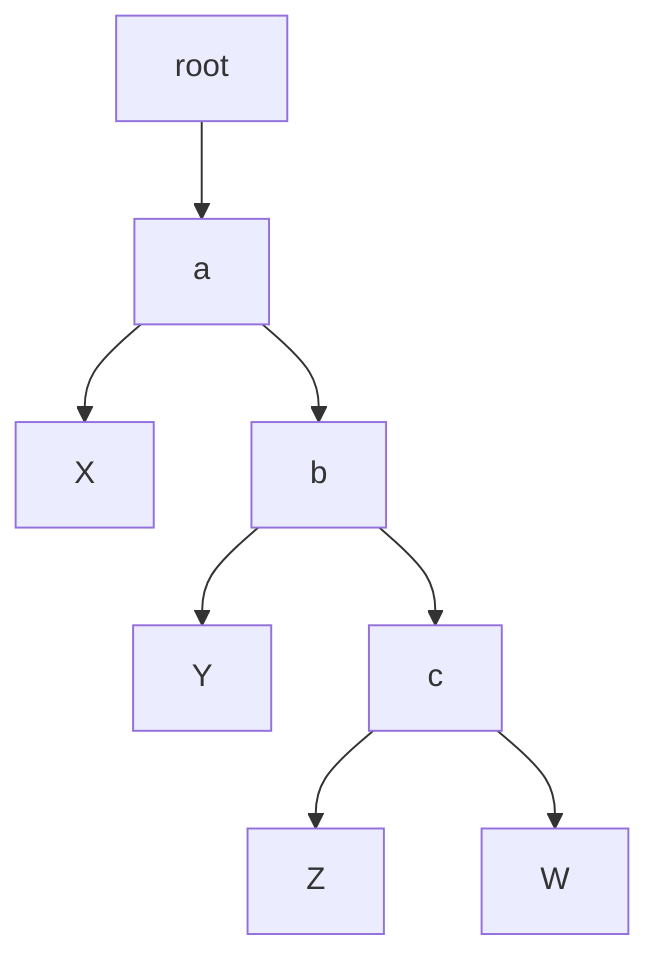
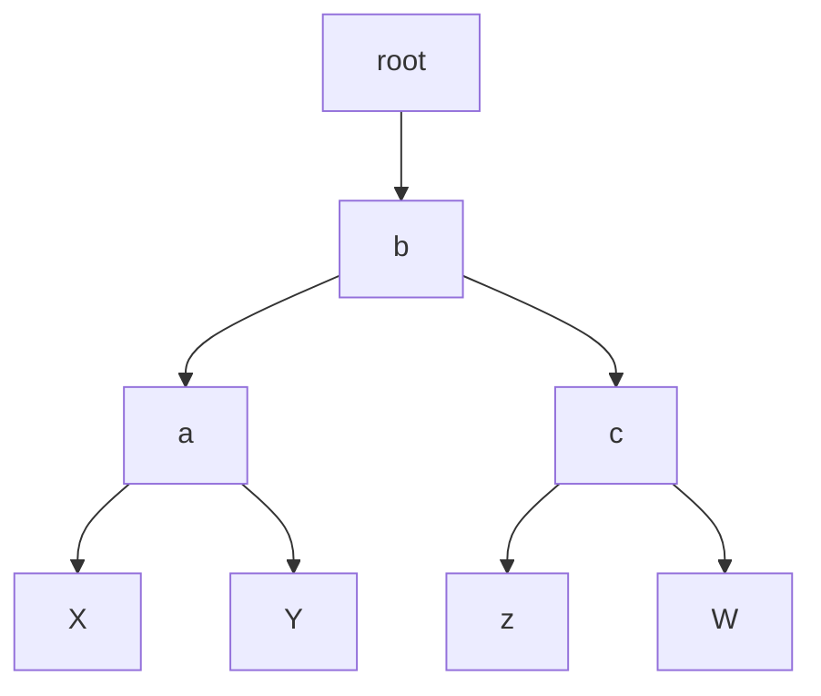
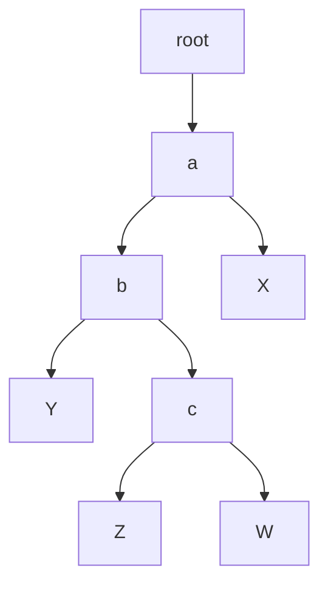
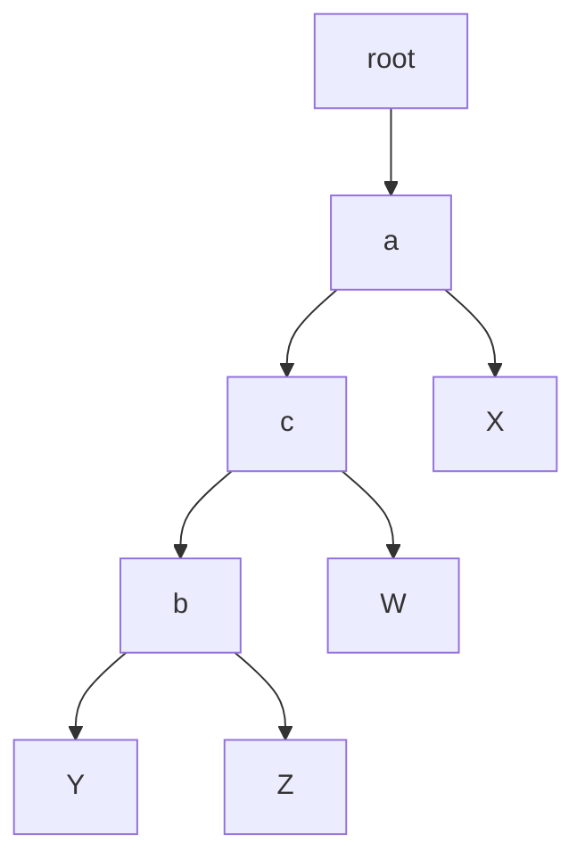
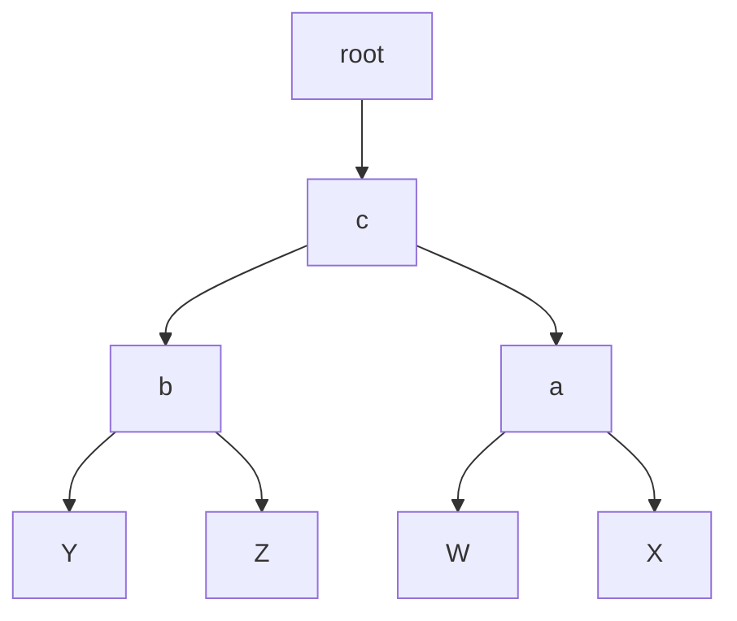
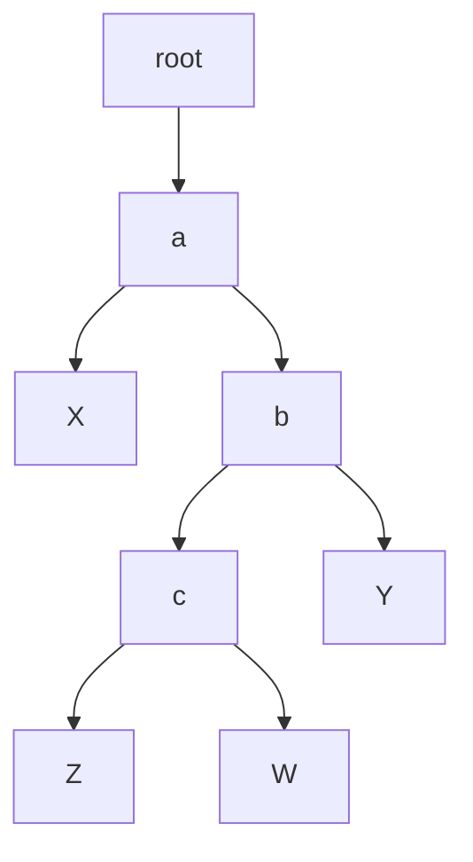
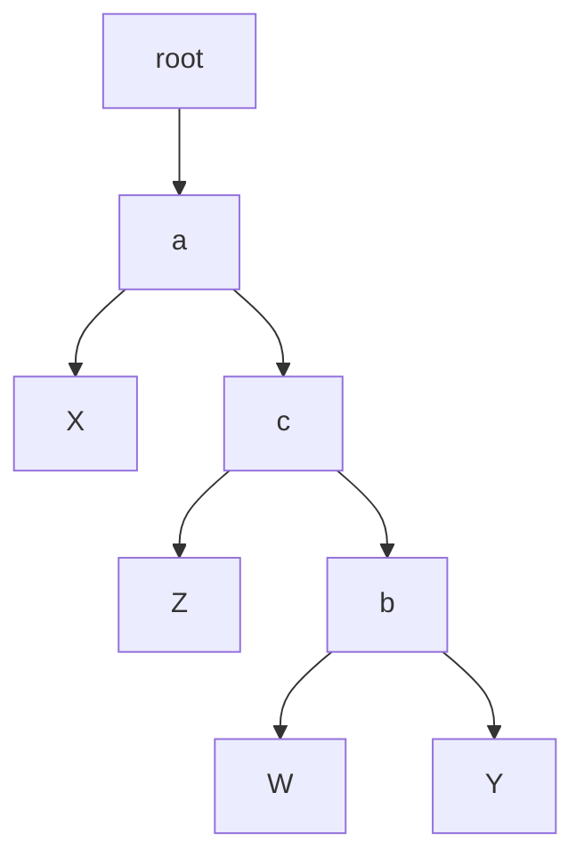
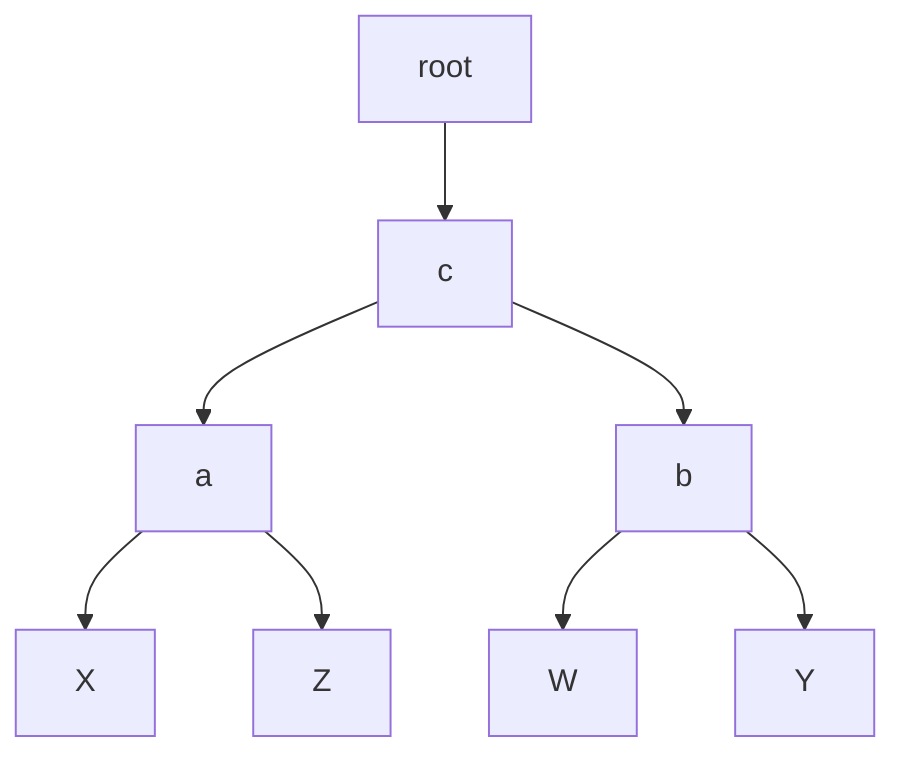

## 不平衡树的4种基本情形
- [不平衡树的4种基本情形](#不平衡树的4种基本情形)
  - [LL型](#ll型)
  - [RR型](#rr型)
  - [LR型](#lr型)
  - [RL型](#rl型)

### LL型

变换步骤：`a` 相对 `b` 做 `右旋` 变换

1. a->left = b->right
2. b->right = a
3. root->next = b

### RR型

变换步骤：`a` 相对 `b` 做 `左旋` 变换

1. a->right = b->left
2. b->left = a
3. root->next = b

### LR型

变换步骤：
1. `b` 相对 `c` 做 `左旋` 变换
2. `a` 相对 `c` 做 `右旋` 变换
3. root->next = c

### RL型

变换步骤：
1. `b` 相对 `c` 做 `右旋` 变换
2. `a` 相对 `c` 做 `左旋` 变换
3. root->next = c

