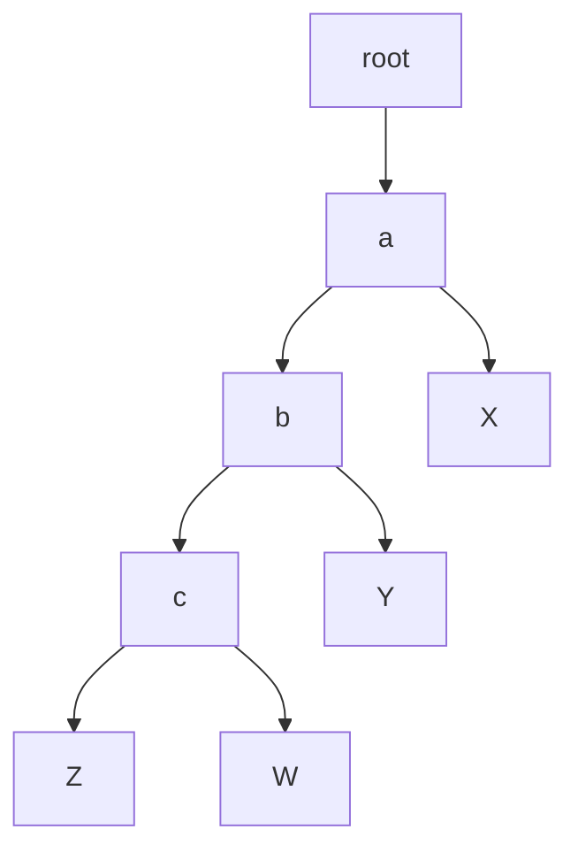
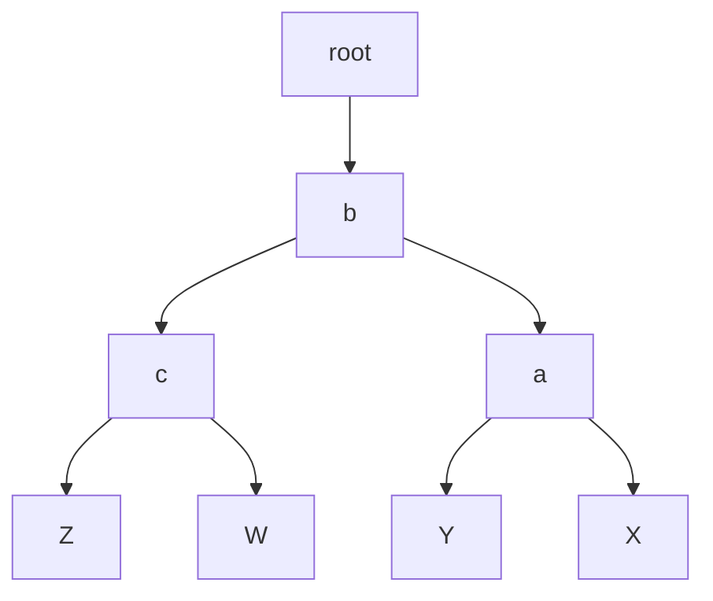
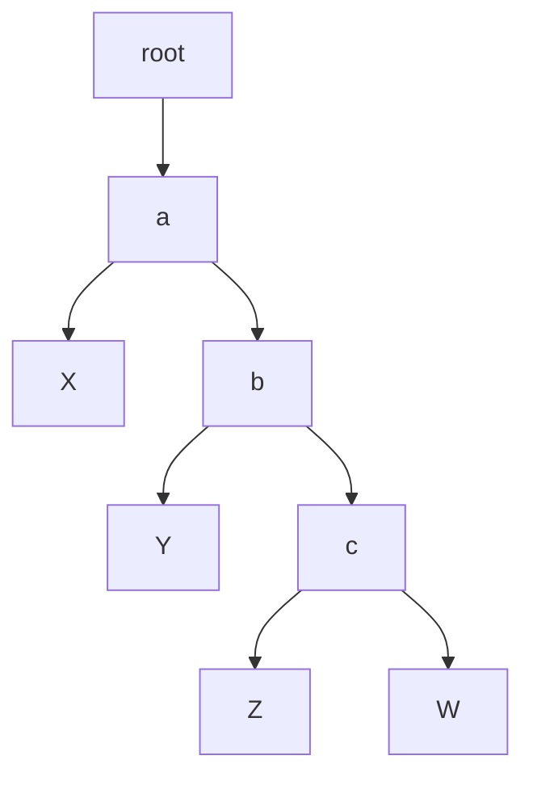
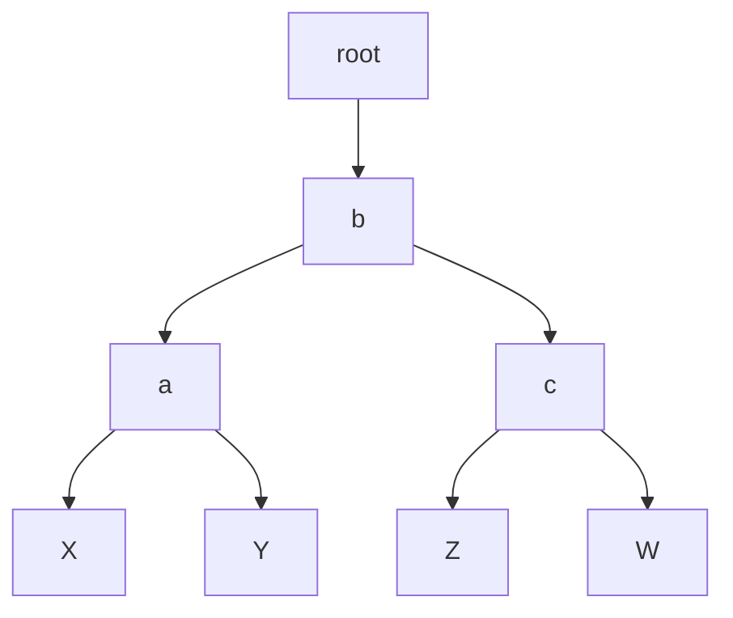
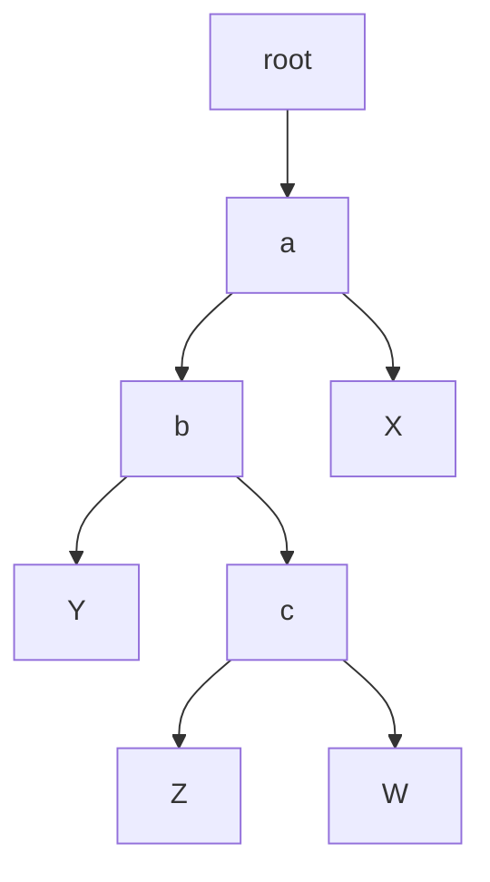
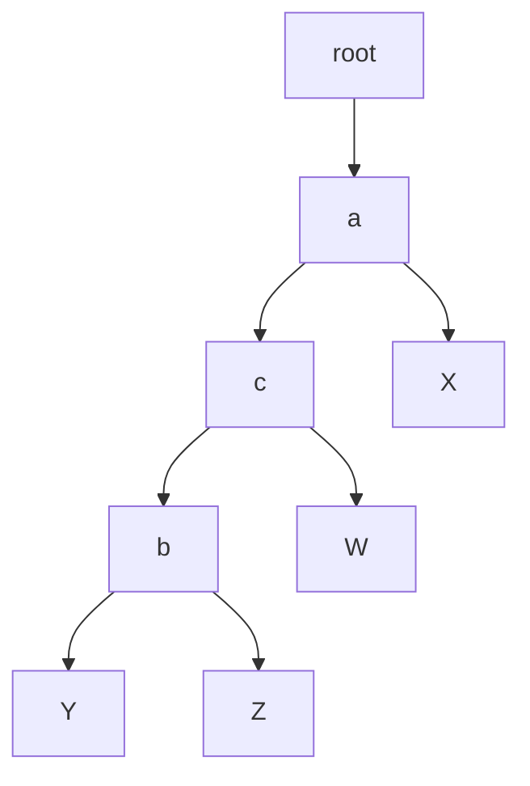
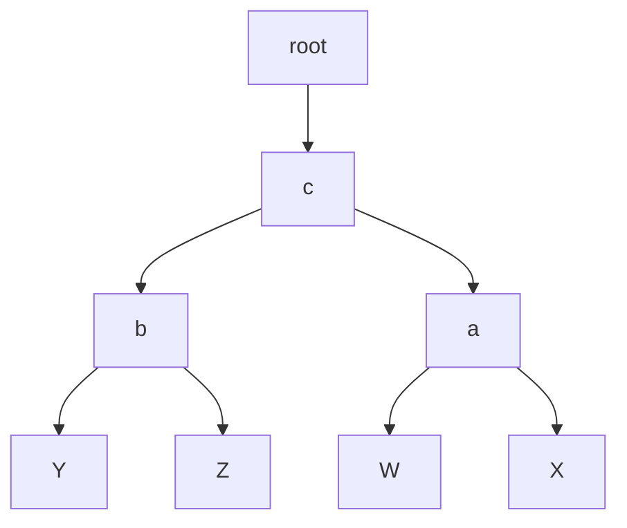
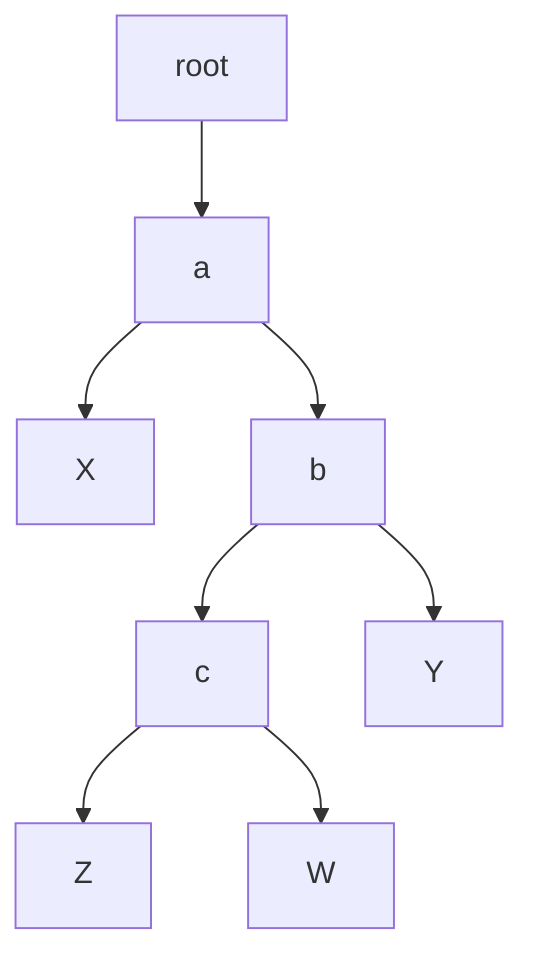
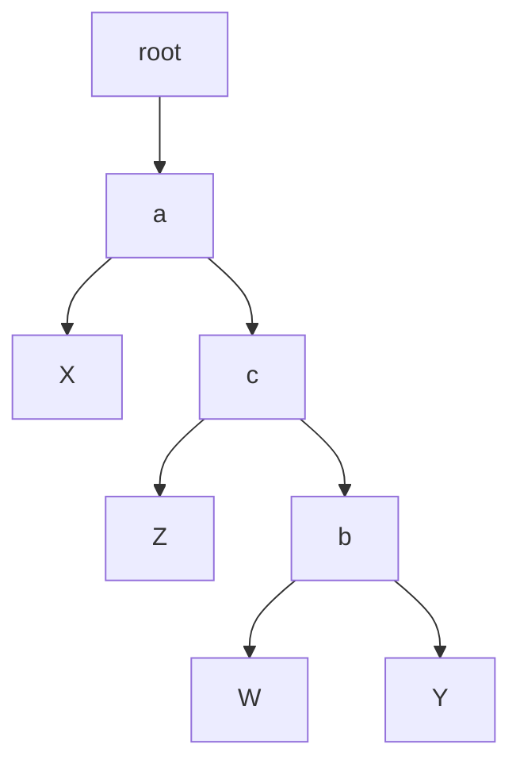
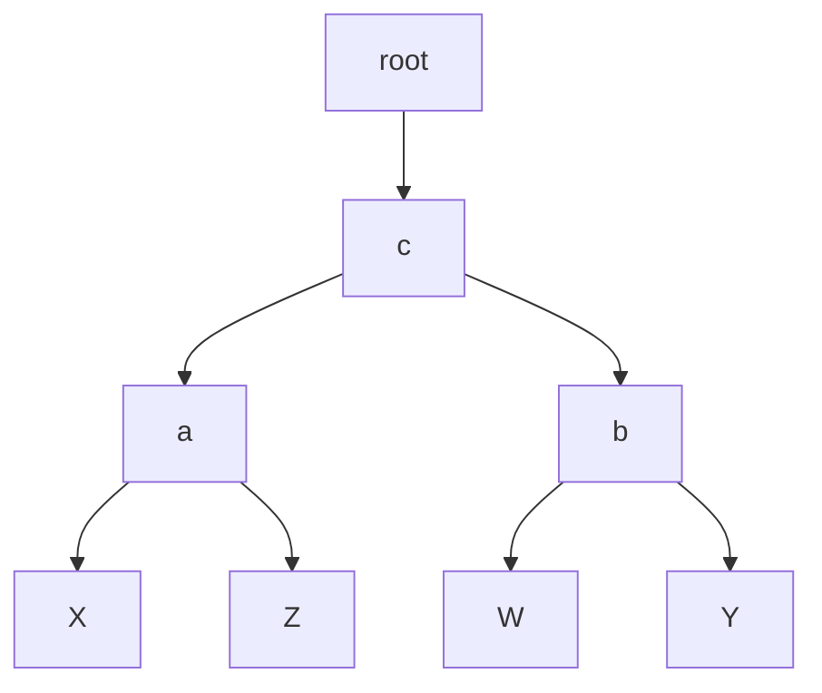

## 不平衡树的4种基本情形
- [不平衡树的4种基本情形](#不平衡树的4种基本情形)
  - [LL型](#ll型)
  - [RR型](#rr型)
  - [LR型](#lr型)
  - [RL型](#rl型)

### LL型

变换步骤：`a` 相对 `b` 做 `右旋` 变换

1. `a->left = b->right`
2. `b->right = a`
3. `root->next = b`

### RR型

变换步骤：`a` 相对 `b` 做 `左旋` 变换
1. `a->right = b->left`
2. `b->left = a`
3. `root->next = b`

### LR型

分步变换：
1. `b` 相对 `c` 做 `左旋` 变换
2. `a` 相对 `c` 做 `右旋` 变换

一步到位法:
1. `b->right = c->left`
2. `c->left = b`
3. `a->left = c->right`
4. `c->right = a`
5. `root->next = c`

### RL型

分步变换：
1. `b` 相对 `c` 做 `右旋` 变换
2. `a` 相对 `c` 做 `左旋` 变换

一步到位法：
1. `a->right = c->left`
2. `c->left = a`
3. `b->left = c->right`
4. `c->right = b`
5. `root->next = c`

