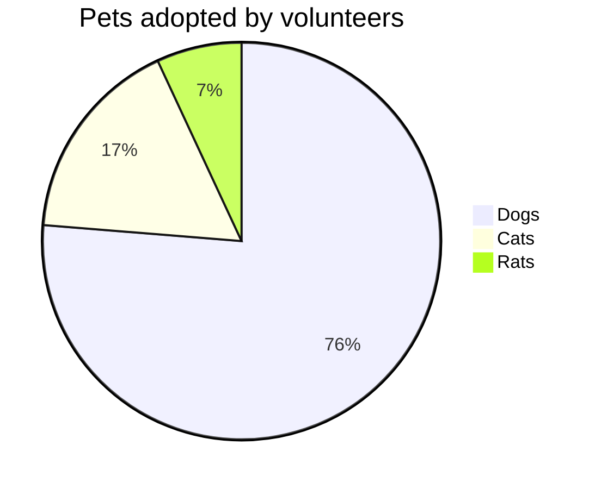
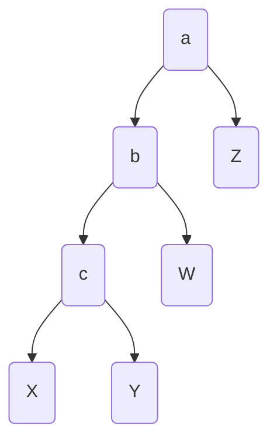

### 数学公式
$$
 \sum_{i=0}^N f(x_i) \Delta x 
$$

### 导入图片

网络图片：

### 饼图

```mermaid
pie title Pets adopted by volunteers
  "Dogs" : 386
  "Cats" : 85
  "Rats" : 35
```

### 结构图

```mermaid
    graph TD
    1(a)-->2(b)-->3(c)-->4(X)
    3(c)-->5(Y)
    1(a)-->6(Z)
    2(b)-->7(W)
```
