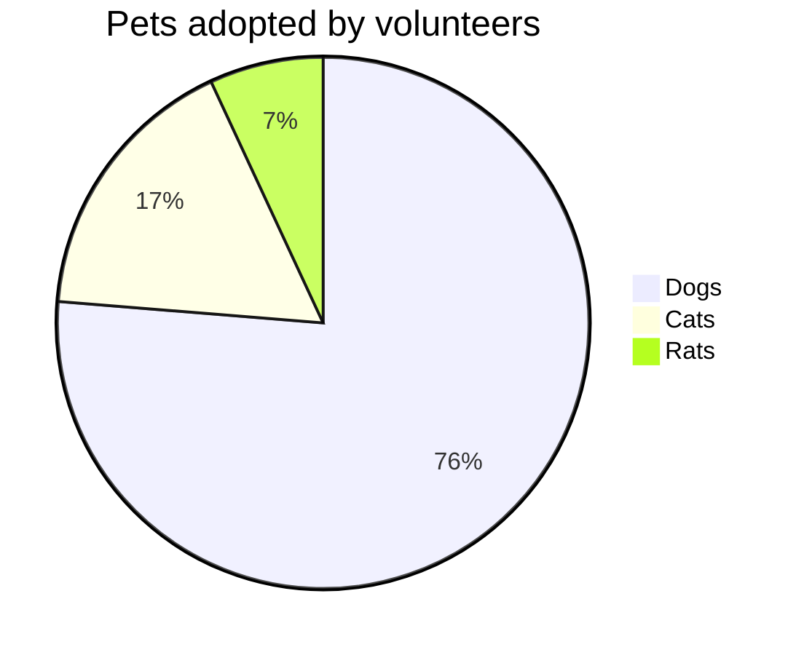
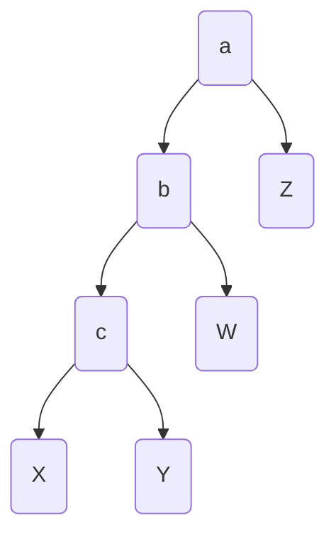
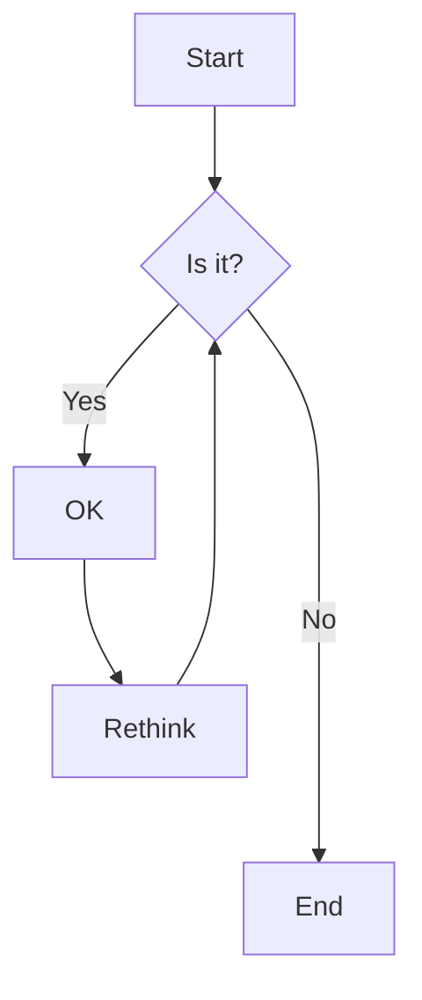

### 列表元素
1. 有序列表1
2. 有序列表2
   1. 有序列表2.1
   2. 有序李彪2.2
3. 有序列表3

- 无序列表1
- 无序列表2
  - 无序列表2.1
  - 无序列表2.2
- 无序列表3

### 引用
> 这是一段引用

### 代码块

#### C语言
```c
#include <iostream>
using namespace std;
int main(void){
  printf("Hello World!\n");
  return 0;
}
```

#### matlab脚本
```matlab
x = linspace(0,1,100);
y = x.^2 + 1;
plot(x,y,"r.-");
```

### python脚本
```python
import numpy as np
if __name__ == __main__:
  print("Hello World")
  x = np.arange(1,21)
  y = x**2
```

### 数学公式

#### 行内公式

$ \sum_{i=0}^N f(x_i) \Delta x $

#### 行间公式

$$
  F(\omega) = \mathcal F[f(t)] = \int_{-\infty}^{\infty} f(t)\mathrm e^{-i \omega t}\, \mathrm d t
$$

### 导入图片

网络图片：


本地图片：


### mermaid

#### 饼图


#### 结构图


#### 流程图

