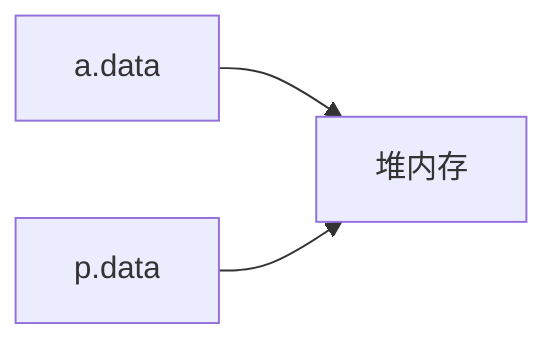

# STL容器内存管理

在使用STL容器时，需要面对各种可能数据类型进行管理，它们有的是基本数据类型，有的是结构体、有的是类对象，也有的是这些类型的指针，或是其他更加复杂的复合形式。在如此复杂的情形下，稍有不慎就会导致野指针、内存泄漏等问题，本文就如何正确处理这些问题做一个归纳总结。


## 问题引出

### 栈变量与堆变量

声明在栈上的变量，其生命周期被限制在各自的作用域上，脱离作用域，变量自动释放

```cpp
void func(){
    int a = 10;     // a作用域的开始
    // a存在的作用域
}   // 函数返回，a自动释放

int main(void){
    // a 不存在于函数外的作用域
    func();
    // a 不存在于函数外的作用域
    return 0;
}
```

声明在堆上的变量，即便指向它的指针被释放，堆变量也仍然存在，只是程序再也无法控制这段内存，所以被称为**内存泄漏**

```cpp
void func(){
    int *ptr = new int;
    // 申请但没有释放，内存泄漏
}

int main(void){
    func();
    // ptr在func()返回时被释放，再也没有任何方法访问new申请的int内存空间
    return 0;
}
```

这里要注意的是
1. 在 `func()` 中，`ptr` 是栈变量，而 `ptr` 指向的内存空间是堆空间
2. `ptr` 在 `func()` 返回时会自动释放，而 `ptr` 指向的内存不会


因此，动态内存(堆内存)的使用，必须有始有终。

- 在C语言中，有 `malloc()` 就有 `free()` 
- 在C++中，有 `new` 就有 `delete`

两者必须一一对应，否则：

- "申请"比"释放"多：内存泄漏
- "申请"比"释放"少：多次释放

## 动态内存谁来管？

### 自动和手动

1. 在C语言中，对于使用了动态内存的代码封装，一般都有一对明确的"初始化"和"销毁"操作，例如文件io操作中的 `open()` 和 `close()` 
2. 在c++中，一般在构造函数中申请堆内存，在析构函数中释放堆内存(需要手动编写释放逻辑)。

c++中，类的实例化分为"栈实例化"与"堆实例化"

```cpp
class A{
    int *data;
    public:
        A():data(new int){}
        ~A(){delete data;}
};

int main(void){
    A a;                // 栈实例化，调用构造，a.data申请动态内存
    A *pa = new A;      // 堆实例化，调用构造，pa->data申请动态内存
    A *pa_ok = new A;
    delete pa_ok;
    return 0;
    // 栈变量a自动释放，触发析构函数释放a.data指向的堆内存
    // 栈变量pa自动释放，但是*pa和pa->data都没有释放，这两个堆内存空间泄漏
    // 栈变量pa_ok自动释放，在这之前，析构函数被自动调用
    // pa_ok->data指向的堆空间先释放，而后pa_ok指向的声明在堆空间上的A实例被释放，最后栈变量pa_ok被释放
}
```

正因为动态内存的管理中同时存在着"自动"和"手动"两种行为，因此很容易出现"多释放"和"漏释放"两种情况。

因此，明确谁是这块堆空间的实际管理者，非常重要。


### 指针的备份

指针是堆内存的控制杆(handler)，丢失了控制杆就丢失了堆内存(泄漏)。然而，指针可以不唯一，这就导致了**多重释放**的潜在风险。

#### 一个典型的错误示例

```cpp
#include <iostream>
using namespace std;

class A{
    int *data;
    public:
        A():data(new int){
            printf("构造函数初始化 this=%#x data=%#x\\n", this, data);
        }
        ~A(){
            delete data;
            printf("析构函数调用 this=%#x\\n", this);
        }
};

void func_value(A p){}       // 空函数，只为了演示值传递的效果

int main(void){
    A a;
    func_value(a);
    return 0;   // 在结束时会发生报错
}
```

> 严谨地来说，"指针"是存储地址的变量，但有时为了表述方便，会直接称呼"地址"为"指针"，因为我们倾向于将变量的概念等同于其存储的值的概念，这在一定程度上造成了混淆，需要结合语境进行区分。例如，指针传递实际上是地址值的传递。

以上代码在执行到主函数的返回时会发生报错，报错位置在类A析构函数的 `delete data;` 行

#### 发生了什么？

类对象的值传递默认为"浅拷贝"，即拷贝所有成员变量的"值"，对指针而言，地址值的复制意味着多了一个指针指向同一块堆内存



对象的值传递导致指针也复制了一份，而函数的形式参数同时也是该函数的局部变量，还是个栈变量。

当 `func_value()` 中返回时，局部变量 `p` 会自动调用其析构函数，释放其成员指针 `data` 指向的堆空间。回到主函数时，唯一的堆空间已经被释放，此时的 `a.data` 已经是一个野指针。然而，在主函数返回时，`a` 的析构函数被调用，使得其 `data` 再次被释放，于是触发了报错。

问题的直接原因在于：局部变量退出作用域使得对象析构函数被调用，作为值传入的对象擅自释放了目标堆空间。

问题的根本原因在于: **同一块堆内存被多个模块拥有，每个模块都有权力释放这块堆内存**，导致其他模块对已释放的堆内存进行非法的操作。

在上述案例中，两个模块分别是 `func_value()` 中的形式参数 `p` 和 `main()` 中的局部变量 `a`。

### 解决的思路

#### 早期方案：指针传递、引用传递

导致问题的直接原因是局部变量的析构函数被调用，因此只需要保证变量不是局部作用域就能行，将对象作为指针传递，本质上是将其地址值传入，指针的释放不会影响其指向的目标，也不会触发析构函数的执行，避开了堆内存的二次释放。而引用传递的实质是指针传递的语法糖，同样不会误触析构函数，达到了同样的效果。

然而根本问题仍然存在，由于维护堆内存的指针存在多个备份，被不同的模块管理，这些模块之间往往相互独立，隐患依然存在。

#### 现代方案：所有权和智能指针

// 未完待续

