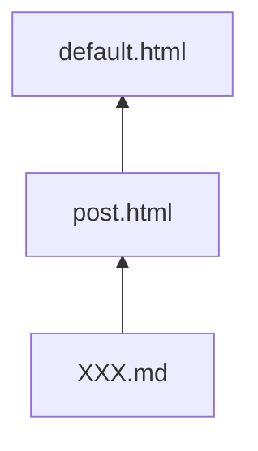

# Wind's Blog折腾记录

### 问题引出

2022年，GitHub主站通过workflow提供了[mermaid支持](https://github.blog/developer-skills/github/include-diagrams-markdown-files-mermaid/)，然而该服务尚未在GitHub Pages上得到支持。

在原生jekyll中，可以通过插件的方式实现Mermaid和LaTeX表达式等内容的渲染，而在Github Pages中部署的jekyll默认只启用[白名单](https://pages.github.com/versions/)中的插件，其允许使用的插件非常有限，jekyll-mermaid等插件不在其中。标准的Markdown语法也并不支持LaTeX数学公式的渲染，同样没有相关插件支持。


### 解决方案

参考博客 [如何让 GitHub Pages 中通过 Markdown 编辑的博客支持 Mermaid？](https://juejin.cn/post/7208046833329930300) 中的做法：在jekyll项目的 `_includes` 目录（如果没有就手动创建该目录）下创建一个 `.html` 文件用来加载外部CDN服务的Mermaid脚本，如 `mermaid_support.html`。内容如下

```html
<script type="module">
    import mermaid from 'https://cdn.jsdelivr.net/npm/mermaid@10.0.2/+esm';
    mermaid.initialize({ startOnLoad: false });
    await mermaid.run({
        querySelector: '.language-mermaid',
    });
</script>
```
此时还不能生效，需要将其加载到目标页面中。

jekyll加载 `.md` 文件时，会读取其上方的 `layout: xxx` 配置项，如这一项不存在，则默认为 `layout: post`，即加载 `_layouts` 下的 `post.html`。

> Github Pages的jekyll所[支持的Theme](https://pages.github.com/themes/)中，参考它们库中的 `_layouts` 目录，这是在部署到Github Pages时默认载入且不会出现在本地的文件，按照[jekyll官方文档-Theme](https://jekyllrb.com/docs/themes/)的描述，通过在本地创建对应的目录和同名的文件以覆盖默认文件，实现主题的定制化。

GitHub Pages所支持的主题通常包含 `default.html` 和 `post.html` 两个layout，而在我们的 `XXX.md` 中又导入了 `post.html` ，所以三者的关系通常是



从对应的jekyll主题库中复制对应的 `default.html` 下来，拷贝到自己的 `_layouts` 目录下。打开浏览可以注意到里面的head标签

```html
<head>
  <meta charset='utf-8'>
  <meta http-equiv="X-UA-Compatible" content="IE=edge">
  <meta name="viewport" content="width=device-width, initial-scale=1">
  <link rel="stylesheet" href="{{ '/assets/css/style.css?v=' | append: site.github.build_revision | relative_url }}">
  
  
</head>
```

> `` 是[Liquid模板](https://liquid.bootcss.com/)语言

`` 其实是开放给我们自定义的头部，这样我们可以不用修改默认 `default.html`，比较优雅的做法是在 `_include` 目录下手动创建一个 `head_custom.html` 并写入以下内容

```html



```


同样，参考博客 [Github page数学公式无法正常显示解决方案(MathJax)](https://www.cnblogs.com/tungsten106/p/17953452/github_page_add_mathjax) 通过类似的做法实现对LaTeX公式的渲染


